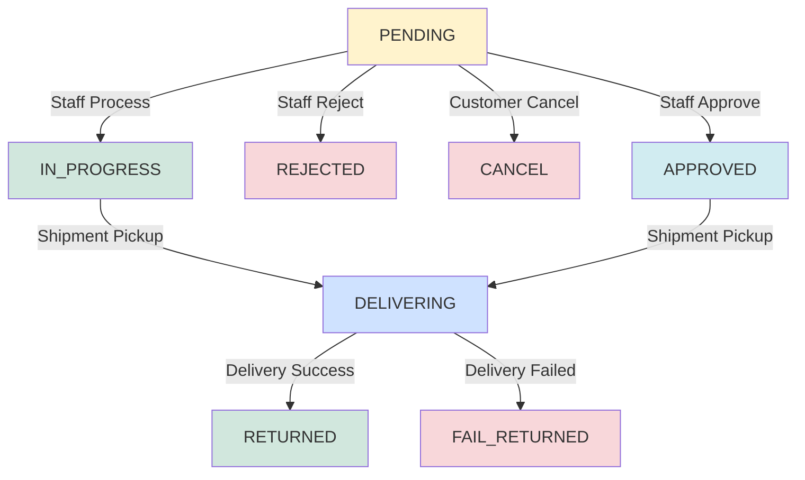

# Return Ticket API - Complete Reference

**Base URLs:**
- Client: `http://localhost:5000/api/v1/client/return-tickets`
- Admin: `http://localhost:5000/api/v1/admin/return-tickets`

---

## 📋 Table of Contents
- [Client Endpoints](#-client-endpoints)
- [Admin/Staff Endpoints](#-adminstaff-endpoints)
- [Public Callback Endpoints](#-public-callback-endpoints)
- [Return Ticket Status Flow](#-return-ticket-status-flow)

---

## 🛒 Client Endpoints

### 1. Create Return Ticket

**Method:** `POST`
**URL:** `/api/v1/client/return-tickets`

Khách hàng tạo yêu cầu trả hàng cho đơn hàng đã mua.

#### Headers
```
Authorization: Bearer {{customer_token}}
Content-Type: application/json
```

#### Request Body
```json
{
  "orderId": "675a1b2c3d4e5f6789012345",
  "reason": "Sản phẩm bị lỗi",
  "description": "Gọng kính bị gãy tay cầm bên phải, không đúng như mô tả",
  "media": [
    "https://storage.example.com/images/defect1.jpg",
    "https://storage.example.com/images/defect2.jpg"
  ]
}
```

#### Request Fields
| Field | Type | Required | Description |
|-------|------|----------|-------------|
| `orderId` | string | ✅ | ID của đơn hàng cần trả |
| `reason` | string | ✅ | Lý do trả hàng (ngắn gọn) |
| `description` | string | ✅ | Mô tả chi tiết vấn đề |
| `media` | string[] | ❌ | Mảng URL hình ảnh/video minh chứng (optional) |

#### Response (201 Created)
```json
{
  "success": true,
  "message": "Tạo yêu cầu trả hàng thành công",
  "data": {
    "returnTicket": {
      "_id": "675b1c2d3e4f5678901234ab",
      "orderId": "675a1b2c3d4e5f6789012345",
      "customerId": "674a1b2c3d4e5f6789012300",
      "reason": "Sản phẩm bị lỗi",
      "description": "Gọng kính bị gãy tay cầm bên phải, không đúng như mô tả",
      "media": [
        "https://storage.example.com/images/defect1.jpg",
        "https://storage.example.com/images/defect2.jpg"
      ],
      "status": "PENDING",
      "staffVerify": null,
      "createdAt": "2026-03-21T10:30:00.000Z",
      "updatedAt": "2026-03-21T10:30:00.000Z"
    }
  }
}
```

---

### 2. Get Client Return Ticket List

**Method:** `GET`
**URL:** `/api/v1/client/return-tickets`

Khách hàng xem danh sách các yêu cầu trả hàng của mình.

#### Headers
```
Authorization: Bearer {{customer_token}}
```

#### Query Parameters
| Parameter | Type | Required | Default | Description |
|-----------|------|----------|---------|-------------|
| `page` | number | ❌ | 1 | Số trang |
| `limit` | number | ❌ | 10 | Số lượng items/trang |
| `status` | string | ❌ | - | Filter theo status (PENDING, IN_PROGRESS, APPROVED, etc.) |
| `orderId` | string | ❌ | - | Filter theo order ID |
| `search` | string | ❌ | - | Tìm kiếm theo reason/description |

#### Example Request
```
GET /api/v1/client/return-tickets?page=1&limit=10&status=PENDING
```

#### Response (200 OK)
```json
{
  "success": true,
  "message": "Get return ticket list successfully",
  "data": {
    "pagination": {
      "page": 1,
      "limit": 10,
      "total": 2,
      "totalPages": 1
    },
    "returnTicketList": [
      {
        "id": "699be80b21d0c73c94dc1bc9",
        "orderId": "6980096593491cb7cb7cfc20",
        "customerId": "6968a5e8f1b5f9eb080bb411",
        "reason": "Sai sản phẩm / không vừa",
        "description": "Mô tả chi tiết lý do trả hàng",
        "media": [
          "https://example.com/image1.jpg",
          "https://example.com/video1.mp4"
        ],
        "staffVerify": "697721d30d0539c69f204330",
        "status": "PENDING",
        "createdAt": "12:39:23 23/02/2026",
        "updatedAt": "12:48:17 23/02/2026"
      }
    ]
  }
}
```

---

### 3. Cancel Return Ticket

**Method:** `PATCH`
**URL:** `/api/v1/client/return-tickets/:id/status/cancel`

Khách hàng hủy yêu cầu trả hàng (chỉ khi status là PENDING).

#### Headers
```
Authorization: Bearer {{customer_token}}
```

#### Path Parameters
| Parameter | Type | Required | Description |
|-----------|------|----------|-------------|
| `id` | string | ✅ | ID của return ticket cần hủy |

#### Example Request
```
PATCH /api/v1/client/return-tickets/675b1c2d3e4f5678901234ab/status/cancel
```

#### Response (200 OK)
```json
{
  "success": true,
  "message": "Cancel return ticket successfully",
  "data": {
    "id": "675b1c2d3e4f5678901234ab",
    "orderId": "675a1b2c3d4e5f6789012345",
    "customerId": "674a1b2c3d4e5f6789012300",
    "reason": "Sản phẩm bị lỗi",
    "description": "Gọng kính bị gãy tay cầm bên phải",
    "media": [
      "https://storage.example.com/images/defect1.jpg"
    ],
    "quantity": 1,
    "money": 500000,
    "staffVerify": null,
    "status": "CANCEL",
    "createdAt": "10:30:00 21/03/2026",
    "updatedAt": "11:00:00 21/03/2026"
  }
}
```

---

## 👨‍💼 Admin/Staff Endpoints

### 4. Get Staff Return Ticket List

**Method:** `GET`
**URL:** `/api/v1/admin/return-tickets`

Nhân viên/Admin xem tất cả yêu cầu trả hàng trong hệ thống.

#### Headers
```
Authorization: Bearer {{staff_token}}
```

#### Query Parameters
| Parameter | Type | Required | Default | Description |
|-----------|------|----------|---------|-------------|
| `page` | number | ❌ | 1 | Số trang |
| `limit` | number | ❌ | 10 | Số lượng items/trang |
| `status` | string | ❌ | - | Filter theo status |
| `orderId` | string | ❌ | - | Filter theo order ID |
| `customerId` | string | ❌ | - | Filter theo customer ID |
| `staffVerify` | string | ❌ | - | Filter theo staff ID đã xử lý |
| `search` | string | ❌ | - | Tìm kiếm theo reason/description |

#### Response (200 OK)
```json
{
  "success": true,
  "message": "Get staff return ticket list successfully",
  "data": {
    "pagination": {
      "page": 1,
      "limit": 10,
      "total": 22,
      "totalPages": 3
    },
    "returnTicketList": [
      {
        "id": "69bce442ed95ed53394ab3fe",
        "orderId": "69bce15ced95ed53394aa804",
        "customerId": "69a586dcd590e7f63e2e61e5",
        "reason": "DAMAGE",
        "description": "kinh dom vai",
        "media": [
          "https://res.cloudinary.com/drwibpl5h/image/upload/v1773986881/vhx8jnra5e6ozfoimlno.jpg"
        ],
        "quantity": 1,
        "money": 9000,
        "staffVerify": "6967398b5d7f69364c03cea9",
        "status": "APPROVED",
        "createdAt": "13:08:02 20/03/2026",
        "updatedAt": "09:00:05 21/03/2026"
      },
      {
        "id": "69b62cf04ecc22db8805e266",
        "orderId": "69b627b15eed2904bbc2d8ec",
        "customerId": "6968afb935533d1b0e9c47dc",
        "reason": "WRONG_ITEM",
        "description": "huhu",
        "media": [
          "https://res.cloudinary.com/drwibpl5h/image/upload/v1773546735/sjpkhntxtc4bn9sslrwg.png"
        ],
        "quantity": 1,
        "money": 380000,
        "staffVerify": null,
        "status": "PENDING",
        "createdAt": "10:52:16 15/03/2026",
        "updatedAt": "10:52:16 15/03/2026"
      }
    ]
  }
}
```

---

### 5. Get Return Tickets by Staff (My History)

**Method:** `GET`
**URL:** `/api/v1/admin/return-tickets/my-history`

Nhân viên xem các yêu cầu trả hàng mà mình đã xử lý.

#### Headers
```
Authorization: Bearer {{staff_token}}
```

#### Query Parameters
Same as endpoint #4

#### Response (200 OK)
```json
{
  "success": true,
  "message": "Get my return ticket history successfully",
  "data": {
    "pagination": {
      "page": 1,
      "limit": 10,
      "total": 15,
      "totalPages": 2
    },
    "returnTicketList": [
      {
        "id": "69bce442ed95ed53394ab3fe",
        "orderId": "69bce15ced95ed53394aa804",
        "customerId": "69a586dcd590e7f63e2e61e5",
        "reason": "DAMAGE",
        "description": "kinh dom vai",
        "media": [
          "https://res.cloudinary.com/drwibpl5h/image/upload/v1773986881/vhx8jnra5e6ozfoimlno.jpg"
        ],
        "quantity": 1,
        "money": 9000,
        "staffVerify": "6967398b5d7f69364c03cea9",
        "status": "APPROVED",
        "createdAt": "13:08:02 20/03/2026",
        "updatedAt": "09:00:05 21/03/2026"
      }
    ]
  }
}
```

---

### 6. Get Returned Orders

**Method:** `GET`
**URL:** `/api/v1/admin/return-tickets/returned-orders`

Lấy danh sách các đơn hàng đã được trả thành công (status = RETURNED).

#### Headers
```
Authorization: Bearer {{staff_token}}
```

#### Query Parameters
Same as endpoint #4

#### Response (200 OK)
```json
{
  "success": true,
  "message": "Get returned orders successfully",
  "data": {
    "pagination": {
      "page": 1,
      "limit": 10,
      "total": 27,
      "totalPages": 3
    },
    "returnTicketList": [
      {
        "id": "675b1c2d3e4f5678901234ab",
        "orderId": "675a1b2c3d4e5f6789012345",
        "customerId": "674a1b2c3d4e5f6789012300",
        "reason": "DAMAGE",
        "description": "Sản phẩm bị hư hỏng",
        "media": ["https://storage.example.com/images/defect1.jpg"],
        "quantity": 1,
        "money": 500000,
        "staffVerify": "674c1d2e3f4567890123def0",
        "status": "RETURNED",
        "createdAt": "10:30:00 21/03/2026",
        "updatedAt": "14:00:00 21/03/2026"
      }
    ]
  }
}
```

---

### 7. Update Staff Verify

**Method:** `PATCH`
**URL:** `/api/v1/admin/return-tickets/:id/staff-verify`

Gán nhân viên xử lý cho return ticket (lấy từ token).

#### Headers
```
Authorization: Bearer {{staff_token}}
```

#### Path Parameters
| Parameter | Type | Required | Description |
|-----------|------|----------|-------------|
| `id` | string | ✅ | ID của return ticket |

#### Example Request
```
PATCH /api/v1/admin/return-tickets/675b1c2d3e4f5678901234ab/staff-verify
```

#### Response (200 OK)
```json
{
  "success": true,
  "message": "Update staff verify successfully",
  "data": {
    "id": "675b1c2d3e4f5678901234ab",
    "orderId": "675a1b2c3d4e5f6789012345",
    "customerId": "674a1b2c3d4e5f6789012300",
    "reason": "DAMAGE",
    "description": "Gọng kính bị gãy tay cầm bên phải",
    "media": [
      "https://storage.example.com/images/defect1.jpg"
    ],
    "quantity": 1,
    "money": 500000,
    "staffVerify": "674c1d2e3f4567890123def0",
    "status": "PENDING",
    "createdAt": "10:30:00 21/03/2026",
    "updatedAt": "11:30:00 21/03/2026"
  }
}
```

---

### 8. Approve Return Ticket

**Method:** `PATCH`
**URL:** `/api/v1/admin/return-tickets/:id/status/approved`

Nhân viên duyệt yêu cầu trả hàng.

#### Headers
```
Authorization: Bearer {{staff_token}}
Content-Type: application/json
```

#### Request Body
```json
{
  "staffNote": "Đã xác nhận sản phẩm bị lỗi, chấp nhận yêu cầu trả hàng"
}
```

#### Request Fields
| Field | Type | Required | Description |
|-------|------|----------|-------------|
| `staffNote` | string | ✅ | Ghi chú của nhân viên về quyết định duyệt |

#### Example Request
```
PATCH /api/v1/admin/return-tickets/675b1c2d3e4f5678901234ab/status/approved
```

#### Response (200 OK)
```json
{
  "success": true,
  "message": "Approve return ticket and create shipment successfully",
  "data": {
    "returnTicket": {
      "id": "675b1c2d3e4f5678901234ab",
      "orderId": "675a1b2c3d4e5f6789012345",
      "customerId": "674a1b2c3d4e5f6789012300",
      "reason": "DAMAGE",
      "description": "Gọng kính bị gãy tay cầm bên phải",
      "media": [
        "https://storage.example.com/images/defect1.jpg"
      ],
      "quantity": 1,
      "money": 500000,
      "staffVerify": "674c1d2e3f4567890123def0",
      "staffNote": "Đã xác nhận sản phẩm bị lỗi, chấp nhận yêu cầu trả hàng",
      "status": "APPROVED",
      "createdAt": "10:30:00 21/03/2026",
      "updatedAt": "12:00:00 21/03/2026"
    },
    "shipmentData": {
      "trackingNumber": "GHN123456789",
      "estimatedDelivery": "2026-03-25"
    }
  }
}
```

---

### 9. Reject Return Ticket

**Method:** `PATCH`
**URL:** `/api/v1/admin/return-tickets/:id/status/rejected`

Nhân viên từ chối yêu cầu trả hàng.

#### Headers
```
Authorization: Bearer {{staff_token}}
Content-Type: application/json
```

#### Request Body
```json
{
  "staffNote": "Sản phẩm không có dấu hiệu lỗi từ nhà sản xuất, lỗi do người dùng"
}
```

#### Request Fields
| Field | Type | Required | Description |
|-------|------|----------|-------------|
| `staffNote` | string | ✅ | Ghi chú của nhân viên về lý do từ chối |

#### Example Request
```
PATCH /api/v1/admin/return-tickets/675b1c2d3e4f5678901234ab/status/rejected
```

#### Response (200 OK)
```json
{
  "success": true,
  "message": "Reject return ticket successfully",
  "data": {
    "id": "675b1c2d3e4f5678901234ab",
    "orderId": "675a1b2c3d4e5f6789012345",
    "customerId": "674a1b2c3d4e5f6789012300",
    "reason": "DAMAGE",
    "description": "Gọng kính bị gãy tay cầm bên phải",
    "media": [
      "https://storage.example.com/images/defect1.jpg"
    ],
    "quantity": 1,
    "money": 500000,
    "staffVerify": "674c1d2e3f4567890123def0",
    "staffNote": "Sản phẩm không có dấu hiệu lỗi từ nhà sản xuất, lỗi do người dùng",
    "status": "REJECTED",
    "createdAt": "10:30:00 21/03/2026",
    "updatedAt": "12:30:00 21/03/2026"
  }
}
```

---

### 10. Process Return Ticket (In Progress)

**Method:** `PATCH`
**URL:** `/api/v1/admin/return-tickets/:id/status/in-progress`

Nhân viên bắt đầu xử lý yêu cầu trả hàng.

#### Headers
```
Authorization: Bearer {{staff_token}}
```

#### Example Request
```
PATCH /api/v1/admin/return-tickets/675b1c2d3e4f5678901234ab/status/in-progress
```

#### Response (200 OK)
```json
{
  "success": true,
  "message": "Process return ticket successfully",
  "data": {
    "id": "675b1c2d3e4f5678901234ab",
    "orderId": "675a1b2c3d4e5f6789012345",
    "customerId": "674a1b2c3d4e5f6789012300",
    "reason": "DAMAGE",
    "description": "Gọng kính bị gãy tay cầm bên phải",
    "media": [
      "https://storage.example.com/images/defect1.jpg"
    ],
    "quantity": 1,
    "money": 500000,
    "staffVerify": "674c1d2e3f4567890123def0",
    "status": "IN_PROGRESS",
    "createdAt": "10:30:00 21/03/2026",
    "updatedAt": "13:00:00 21/03/2026"
  }
}
```

---

## 🔄 Public Callback Endpoints

**⚠️ These endpoints do NOT require authentication - called by shipment service**

### 11. Update Status: Delivering

**Method:** `PATCH`
**URL:** `/api/v1/admin/return-tickets/:id/status/delivering`

Đơn vị vận chuyển callback khi hàng đang được vận chuyển về.

#### Example Request
```
PATCH /api/v1/admin/return-tickets/675b1c2d3e4f5678901234ab/status/delivering
```

#### Response (200 OK)
```json
{
  "success": true,
  "message": "Update status to delivering successfully",
  "data": {
    "id": "675b1c2d3e4f5678901234ab",
    "orderId": "675a1b2c3d4e5f6789012345",
    "customerId": "674a1b2c3d4e5f6789012300",
    "reason": "DAMAGE",
    "description": "Gọng kính bị gãy tay cầm bên phải",
    "media": [
      "https://storage.example.com/images/defect1.jpg"
    ],
    "quantity": 1,
    "money": 500000,
    "staffVerify": "674c1d2e3f4567890123def0",
    "status": "DELIVERING",
    "createdAt": "10:30:00 21/03/2026",
    "updatedAt": "13:30:00 21/03/2026"
  }
}
```

---

### 12. Update Status: Returned

**Method:** `PATCH`
**URL:** `/api/v1/admin/return-tickets/:id/status/returned`

Đơn vị vận chuyển callback khi hàng đã được trả về thành công.

#### Example Request
```
PATCH /api/v1/admin/return-tickets/675b1c2d3e4f5678901234ab/status/returned
```

#### Response (200 OK)
```json
{
  "success": true,
  "message": "Update status to returned successfully",
  "data": {
    "id": "675b1c2d3e4f5678901234ab",
    "orderId": "675a1b2c3d4e5f6789012345",
    "customerId": "674a1b2c3d4e5f6789012300",
    "reason": "DAMAGE",
    "description": "Gọng kính bị gãy tay cầm bên phải",
    "media": [
      "https://storage.example.com/images/defect1.jpg"
    ],
    "quantity": 1,
    "money": 500000,
    "staffVerify": "674c1d2e3f4567890123def0",
    "status": "RETURNED",
    "createdAt": "10:30:00 21/03/2026",
    "updatedAt": "14:00:00 21/03/2026"
  }
}
```

---

### 13. Update Status: Fail Returned

**Method:** `PATCH`
**URL:** `/api/v1/admin/return-tickets/:id/status/fail-returned`

Đơn vị vận chuyển callback khi không thể trả hàng (khách không nhận, địa chỉ sai, v.v.).

#### Example Request
```
PATCH /api/v1/admin/return-tickets/675b1c2d3e4f5678901234ab/status/fail-returned
```

#### Response (200 OK)
```json
{
  "success": true,
  "message": "Update status to fail returned successfully",
  "data": {
    "id": "675b1c2d3e4f5678901234ab",
    "orderId": "675a1b2c3d4e5f6789012345",
    "customerId": "674a1b2c3d4e5f6789012300",
    "reason": "DAMAGE",
    "description": "Gọng kính bị gãy tay cầm bên phải",
    "media": [
      "https://storage.example.com/images/defect1.jpg"
    ],
    "quantity": 1,
    "money": 500000,
    "staffVerify": "674c1d2e3f4567890123def0",
    "status": "FAIL_RETURNED",
    "createdAt": "10:30:00 21/03/2026",
    "updatedAt": "14:30:00 21/03/2026"
  }
}
```

---

## 🔀 Return Ticket Status Flow



### Status Descriptions

| Status | Description | Who Can Set |
|--------|-------------|-------------|
| `PENDING` | Yêu cầu mới tạo, chờ nhân viên xử lý | System (auto) |
| `IN_PROGRESS` | Nhân viên đang xử lý | Staff |
| `CANCEL` | Khách hàng hủy yêu cầu | Customer |
| `REJECTED` | Nhân viên từ chối (không đủ điều kiện trả hàng) | Staff |
| `APPROVED` | Nhân viên chấp nhận, chờ vận chuyển | Staff |
| `DELIVERING` | Đơn vị vận chuyển đang lấy hàng về | Shipment Service |
| `RETURNED` | Hàng đã được trả về thành công | Shipment Service |
| `FAIL_RETURNED` | Trả hàng thất bại (khách không nhận/địa chỉ sai) | Shipment Service |

---

## ⚠️ Error Responses

### 400 Bad Request - Validation Error
```json
{
  "success": false,
  "message": "Validation failed",
  "errors": [
    {
      "field": "orderId",
      "message": "Order ID is required"
    },
    {
      "field": "reason",
      "message": "Reason is required"
    }
  ]
}
```

### 401 Unauthorized
```json
{
  "success": false,
  "message": "Token không hợp lệ hoặc đã hết hạn"
}
```

### 403 Forbidden
```json
{
  "success": false,
  "message": "Bạn không có quyền thực hiện thao tác này"
}
```

### 404 Not Found
```json
{
  "success": false,
  "message": "Không tìm thấy yêu cầu trả hàng"
}
```

### 409 Conflict
```json
{
  "success": false,
  "message": "Không thể hủy yêu cầu trả hàng đã được xử lý"
}
```

---

## 📝 Notes

1. **Authentication**:
   - Client endpoints yêu cầu customer token
   - Admin endpoints yêu cầu staff/admin token
   - Public callback endpoints KHÔNG yêu cầu authentication

2. **Status Transitions**:
   - Chỉ có thể cancel khi status = PENDING
   - Chỉ có thể approve/reject/process khi status = PENDING

3. **Media Upload**:
   - Cần upload ảnh/video lên storage service trước
   - Gửi URL đã upload vào field `media`

4. **Pagination**:
   - Default: page=1, limit=10
   - Max limit: 100 items/page

5. **Shipment Integration**:
   - Callback endpoints dùng cho integration với bên vận chuyển
   - Cần whitelist IP của shipment service nếu cần bảo mật

6. **Response Format Differences**:
   - **Client endpoints**: Trả về `returnTicketList` (array) với các trường cơ bản
   - **Admin/Staff endpoints**: Trả về `returnTicketList` (array) bao gồm thêm `quantity` và `money`
   - `quantity`: Số lượng sản phẩm trong đơn hàng cần trả
   - `money`: Số tiền cần hoàn trả cho khách hàng (VNĐ)
   - Date format: `HH:mm:ss DD/MM/YYYY` (VD: "13:08:02 20/03/2026")

7. **Reason Types**:
   - `DAMAGE`: Sản phẩm bị hư hỏng/lỗi
   - `WRONG_ITEM`: Giao sai sản phẩm
   - `NOT_AS_DESCRIBED`: Không đúng mô tả
   - `CHANGE_OF_MIND`: Đổi ý (nếu được phép)
   - Hoặc có thể gửi text tự do
